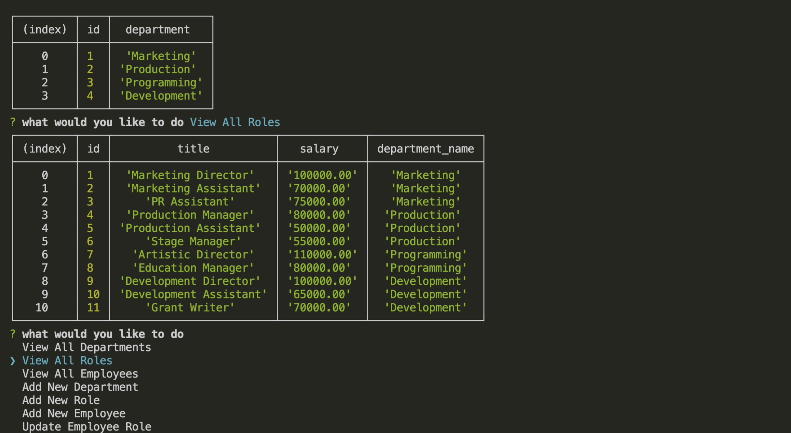

# Employee Database Tracker

The employee tracker is a command-line application that lets the users create, read, and update employee information. 

## Details

The tracker creates three main tables: 
* Department 
    * ID
    * name
* Role
    * ID
    * role
    * salary
* Employee
    * ID 
    * first name
    * last name
    * department
    * manager name

## Contribution
Please do not contribute. This project is complete.

## Demo

[View the video here >](https://drive.google.com/file/d/1Fo8M5_B0vPTkzCj-CSuaSsbd6l4ZgJAa/view?usp=sharing)

## Questions
[Visit the project github page >](https://github.com/jsc-09/employee-tracker) 
Contact: <joanna.s.christian@gmail.com>

